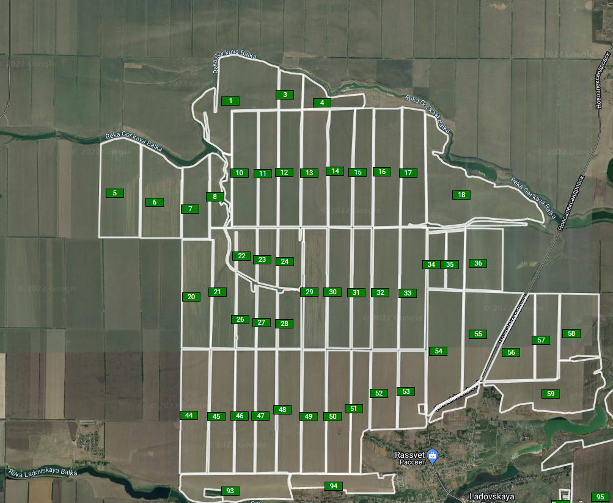

[DEMO](https://demidovez.github.io/argo_map)

Создать одностраничное приложение на React.

Страница должна содержать карту с отрисованными полями (полигонами)

массив точек полигона содержаться в свойстве Location (json), там же координаты центра поля, центр поля должен быть представлен маркером с названием поля

Готовая страница должна выглядеть так:

